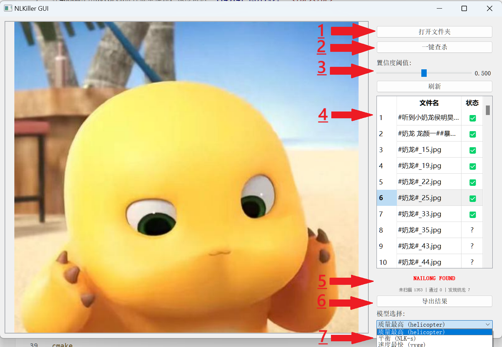

# NaiLongKiller

急速奶龙查杀王

在4060m使用pytorch进行批量推理，速度可达**114514+ 图片/秒！**</br></br>
*推理设置：pytorch2.5.1，yvgg融合模型，batchsize=6144，开启amp加速，准确率: 99.10% 正确率: 95.50% 召回率: 93.74%*

## GUI样例程序使用方法

- 1：点击按钮选择包含（或者可能存在）奶龙的文件夹。
- 2：对选择的文件夹执行一键查杀，此过程根据不同的cpu核心数量会占用不同大小的内存，在8C16T处理器的总占用约2.5G左右。
- 3：设置置信度阈值。每一张图像在经过模型处理后都会被量化为“有XXX的概率是包含奶龙的”，如果图像包含奶龙的概率高于这个值，那么就认为这个图像是**奶龙图！**。发现存在漏图的情况可以降低这个值，出现误判为奶龙的情况就应当调高这个值。
- 4：此处可以快速查看文件夹内图像的奶龙情况，右侧如果发现奶龙就会判为✅，没有就是❌，没有处理过的就是问号。
- 5：红色表示发现奶龙，绿色表示没有发现。下方有整个文件夹内所有图像的统计数据。
- 6：可选择将结果导出为csv文件便于处理。csv文件包含文件的绝对路径、模型输出的“此图像是奶龙”的概率以及是否为奶龙的判断。
- 7：根据不同的需求可以选择不同的推理模型，然而查杀时影响速度的主要因素是图像解码速度而非模型推理速度，因此基本可以无脑考虑最好的直升机模型。

***判别结果由AI生成，请谨慎使用！***
## [*new🚀* WebAPI调用查杀模型](./windows/webapi/README.md)
***使用http网络协议，跨语言调用查杀模型。***<br>
更适合开发者的方案，详情请打开对应文件查看。
## GUI编译环境依赖

- **操作系统**: Linux (Ubuntu 18.04+)
- **编译器**: GCC 7.0+ 或 Clang 6.0+ (支持 C++17)
- **依赖库**:
  - Intel OpenVINO 2023.2.0+
  - Qt5 (Core, Widgets)
  - Intel TBB
  - CMake 3.10+

### 安装依赖

```bash
# 安装基本依赖
sudo apt update
sudo apt install build-essential cmake pkg-config

# 安装 Qt5
sudo apt install qtbase5-dev qt5-qmake

# 安装 Intel OpenVINO
# 请按照官方文档安装 OpenVINO: https://docs.openvino.ai/

# 安装 Intel TBB
sudo apt install libtbb-dev
```

### 编译
位于项目根目录下执行以下命令
```bash
mkdir build && cd build
cmake ..
make -j8
```
### windows系统编译

#### 环境要求
- **操作系统**: Windows 10/11
- **编译器**: Visual Studio 2022 或 CMake + MSVC
- **依赖库**:
  - Intel OpenVINO 2023.2.0+
  - Qt5 (推荐 Qt 5.15.2)
  - CMake 3.10+ (如使用CMake编译)

#### 方法一：使用CMake编译（推荐）

**1. 安装依赖**
- 下载并安装 [Intel OpenVINO](https://docs.openvino.ai/)
- 下载并安装 [Qt5](https://www.qt.io/download)
- 下载并安装 [CMake](https://cmake.org/download/)

**2. 设置环境变量**
```cmd
# 设置OpenVINO环境变量，不同安装方式的路径不一样，ov安装时的路径即可。
set INTEL_OPENVINO_DIR=C:\Program Files (x86)\Intel\openvino_2025
# 设置Qt5环境变量
set Qt5_DIR=C:\Qt\5.15.2\msvc2019_64\lib\cmake\Qt5
```

**3. 编译**
```cmd
# 在项目根目录下执行
mkdir build && cd build
cmake .. -G "Visual Studio 17 2022"
cmake --build . --config Release
```

#### 方法二：使用Visual Studio 2022解决方案

项目提供了预配置的VS2022解决方案文件，位于 `./windows/` 目录下。

**1. 打开解决方案**
```
./windows/windows.sln
```

**2. 配置OpenVINO路径**

在Visual Studio中右键项目 → 属性 → 配置属性，设置以下路径：

**包含目录 (Include Directories)**：
```
C:\Program Files (x86)\Intel\openvino_2025\runtime\include
```

**库目录 (Library Directories)**：
```
C:\Program Files (x86)\Intel\openvino_2025\runtime\lib\intel64\Release
```

**链接器 → 附加依赖项**：
```
openvino.lib
```

**3. 编译项目**
- 选择 Release x64 配置
- 编译完成后，可执行文件位于 `./windows/x64/Release/` 目录，文件名为windows.exe


## 如何操作

### GUI 使用
编译完成后，进入项目根目录下执行以下命令启动程序
```bash
./build/NLKiller
```

1. 启动程序后会自动加载默认模型（helicopter）
2. 点击"打开文件夹"选择包含图像的目录
3. 程序会自动扫描并显示所有支持的图像文件（jpg、png、bmp、tiff、tga）
4. 程序会自动对第一张图片进行推理
5. 调节置信度阈值滑块（默认 0.5）
6. 点击"一键查杀"按钮对所有图像进行批量检测
7. 查看结果表格：✅ 表示正样本，❌ 表示负样本
8. 点击表格中的图像行可以切换预览
9. 点击"刷新"按钮重新应用置信度阈值
10. 点击"导出结果"保存检测结果

**快捷键**: 
- `W/A/↑/←`: 上一张图像
- `S/D/↓/→`: 下一张图像

**模型选择**:
- 质量最高 (helicopter): 检测精度最高
- 平衡 (NLK-s): 精度和速度平衡
- 速度最快 (yvgg): 检测速度最快

### 模型文件

将模型文件放在 `models` 目录下：
- `models/helicopter_simplified.onnx`
- `models/NLK-s_simplified.onnx` 
- `models/yvgg_simplified.onnx`

## 如何使用 NLKiller 类
*推理代码使用ai辅助编写，如有问题请及时提issue*
### 基本使用

```cpp
#include "NLKiller.hpp"

// 创建推理器
NLKiller killer(false, 4);  // verbose=false, 使用异步推理是启用4线程

// 设置设备
killer.setDevice(NLKiller::DeviceType::CPU);// 使用CPU进行推理

// 加载模型
killer.loadModel("model.onnx");// 加载模型，当前模型暂时不支持批量推理。
std::cout << "是否成功加载：" << killer.isModelLoaded() << std::endl;

// 推理单张图像
YTensor<unsigned char, 3> image = NLKiller::image2Tensor(height, width, channels, data);
float result = killer.infer(image);

// 或者使用异步推理
// std::vector<YTensor<unsigned char, 3>> images;
// std::vector<float> results = killer.infer(images, NLKiller::InferenceMode::ASYNC_MULTI);

// 查看推理详细信息
RunInfo runInfo = killer.getLastRunInfo();
/* runinfo结构体包含：
    std::vector<float> results;              // 推理结果
    double total_time;                       // 运行耗时（秒）
    double avg_total_time;                   // 运行平均耗时（秒）
    double inference_time;                   // 推理耗时（秒）
    double avg_inference_time_per_image;     // 平均每张图像推理耗时（秒）
    int num_threads;                         // 推理线程数
    std::string inference_mode;              // 推理模式
    std::string device;                      // 推理设备
*/
std::cout << "total_time: " << runInfo.total_time << std::endl;// 查看总耗时（秒）
```

### 主要接口

```cpp
// 构造函数
NLKiller(bool verbose = false, int num_threads = 1);

// 设备管理
void setDevice(DeviceType device, int gpu_id = 0);
void setNumThreads(int num_threads);

// 模型管理
bool loadModel(const std::string &model_path);
bool isModelLoaded() const;

// 推理接口
float infer(YTensor<u_char, 3> &image);
std::vector<float> infer(std::vector<YTensor<u_char, 3>> &images, InferenceMode mode);

// 工具方法
static YTensor<unsigned char, 3> image2Tensor(int height, int width, int channels, const u_char *data);
const RunInfo& getLastRunInfo() const;
```

### 推理模式

```cpp
enum class InferenceMode {
    SYNC_SINGLE,      // 同步单张推理
    ASYNC_MULTI,      // 异步多线程推理  
    BATCH_SYNC        // 批量同步推理
};
```

### 设备类型

```cpp
enum class DeviceType {
    CPU,              // CPU推理
    GPU               // GPU推理（需要驱动支持，非批量推理还是cpu更快）
};
```
## 模型详情
### yvgg
- 参考了repVGG模型，训练时将卷积层的前后直接残差相连，有助于梯度在训练时的传播，加速训练，改善模型最终效果。推理时将模块融合为卷积层，并使用卷积核的权重进行卷积计算，无需额外的分支开销。
- 大量使用了pw-dw-pw结构，相比标准卷积能够节省计算量，而且相比分组卷积对算子而言，dw卷积以及可以被看做矩阵乘法的pw卷积是被高度优化的，无需额外reshape开销。在amd 680m移动gpu上使用openvino作为推理框架，低延迟设置下推理延迟可达0.2ms以内。
- 训练使用的数据集包含：[3k二分类网络图像](https://huggingface.co/datasets/XiC1/nailong-dataset/blob/main/data/train/nailong.tar)+[5k表情负样本!](https://github.com/LLM-Red-Team/emo-visual-data)+[8k来自yolo数据集提取的正样本](https://universe.roboflow.com/car-recongnition/nailong-fr9w5)+[100k*10%来自object365数据集提取的子集](https://opendatalab.com/OpenDataLab/Objects365)*(其中object365数据来自为总数据集约20%左右的子集，每次从不同的检查点加载重启训练时会以不同的随机数种子再次抽样其中的10%，约包含90k的负样本)*
- 模型训练与推理输入均为128x128的三通道（RGB排布）彩色图像。曾经尝试过64x64大小的图像，但是最终推理速度差不多于是换回了128x128。
- 训练采用多轮重启的训练策略，使用重启余弦学习率调度器，学习周期为10+20+40。学习率从1e-3到1e-7余弦衰减。
- 训练的损失函数使用的是 **Asymmetric loss** ，gamma_pos设置为2.5，gamma_neg设置为4，eps设置为1e-3。经过实验，这个参数能够让当前数据分布的train F1在0.5置信度下分数最高。
- 训练优化器使用 **muon** ，其中muon学习率为基础学习率的10倍，weight decay设置为1e-4。模型内参数学习率按照0.2 x sqrt(max(cols, rows))进行缩放。实测训练速度与训练最终损失均优于RAdam与Adan优化器（muon在图像领域cnn中的表现甚至相较于nlp的transformer优势更加明显，把adam家族远远甩在后面！）。
- yvgg的网络深宽设计：深度为 **[0, 1, 1, 3, 3]** ，宽度倍率设计为 **[\\, 1, 1, 2, 1.5]** ，设计原则是推理延迟，而非准确率。深度代表在当前大小的特征图下会添加 **[深度]** 个的: <br>逐点卷积(扩张到 **[倍率]** 通道数) --> 3x3深度可分离卷积进行空间感知 --> 逐点卷积(收缩到正常通道数)<br> 这样的模块。将最后两种大小的特征图输出进行全局平均池化(GAP)后，拼接在一起，经过一层大小为192隐藏层后输出。训练时参数量为。
- 网络详细结构请使用[Netron](https://netron.app/)查看，位于models文件夹内。
- 数据增强设置：
```nailong
        self.fliph = 0.5                # 水平翻转概率 [0-1]，直接传入RandomHorizontalFlip
        self.flipv = 0.2                # 垂直翻转概率 [0-1]，直接传入RandomVerticalFlip
        self.rotate = 0.1               # 旋转强度 [0-1]，1.0对应180度最大旋转角度
        self.brightness = 0.2           # 亮度变化强度 [0-1]，传入ColorJitter作为变化范围
        self.contrast = 0.2             # 对比度变化强度 [0-1]，传入ColorJitter作为变化范围
        self.saturation = 0.2           # 饱和度变化强度 [0-1]，传入ColorJitter作为变化范围
        self.hue = 0.2                  # 色相变化强度 [0-0.5]，传入ColorJitter作为变化范围
        self.gaussian_blur = 0.4        # 高斯模糊强度 [0-1]，直接作为sigma值
        self.gaussian_blur_prob = 0.4   # 高斯模糊应用概率 [0-1]，控制是否应用模糊
        self.erase_prob = 0.1           # 随机遮挡概率 [0-1]，控制是否应用遮挡
        self.erase_area = 0.2           # 随机遮挡面积 [0-1]，1.0对应最大遮挡面积
        self.shear = 0.1                # 剪切变换强度 [0-1]，1.0对应180度最大剪切角度
        self.affine_scale = 0.1         # 仿射缩放强度 [0-1]，缩放范围为1±参数值
        self.affine_translate = 0.1     # 仿射平移强度 [0-1]，平移范围为图像尺寸*参数值
        self.perspective = 0.1          # 透视变换强度 [0-1]，1.0对应最大透视扭曲
        self.perspective_prob = 0.5     # 透视变换应用概率 [0-1]，控制是否应用透视变换
        self.gaussian_noise = 0.1       # 高斯噪声方差 [0-1]，添加到图像的噪声强度
        self.gaussian_noise_prob = 0.7  # 高斯噪声应用概率 [0-1]，控制是否应用噪声
```

## 更新日志
- 2025.8.21 <br>
    * 完善README
    * 修复批量推理后更换文件夹有概率造成的闪退问题。
    * 优化CPU资源分配，优化缓冲区，批量推理时内存占用大幅减少。
    * 修复异步推理在线程数不足时造成的闪退问题。
    * 更改GUI的批量推理后端为异步推理（原为同步单线程，计划将改为批量推理以增加数据吞吐量）
    * 修复windows平台下导出csv的乱码问题。
- 2025.8.20 <br>
    * 完善README
    * 更新了yvgg模型，提高准确率。
    * 添加webapi调用方式，使用http协议通信实现跨语言调用。
- 2025.8.11 <br>
    * 添加了windows的部署代码
    * 更新了NLK-s模型，提高准确率与鲁棒性。
- 2025.8.6 首次更新
